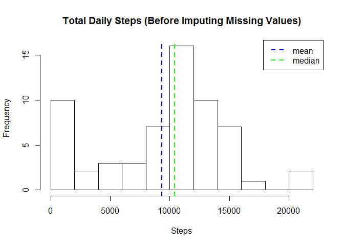
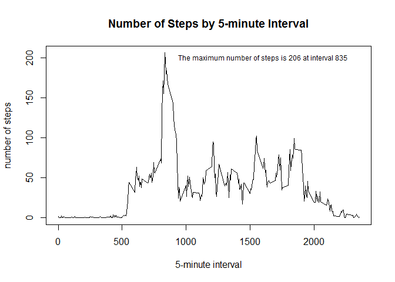
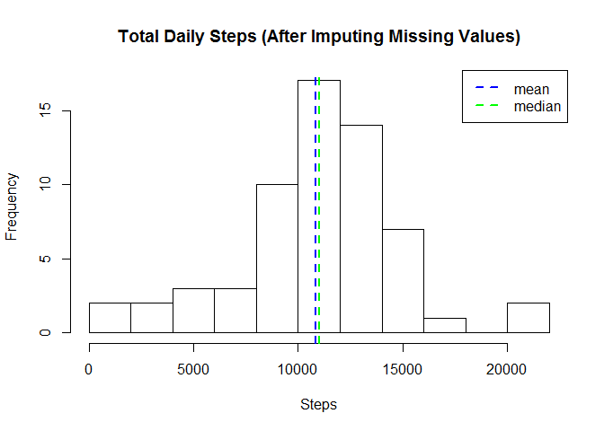
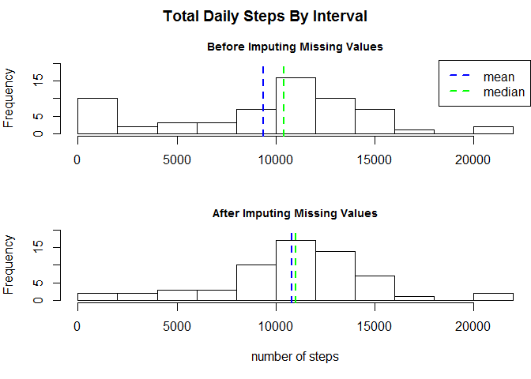
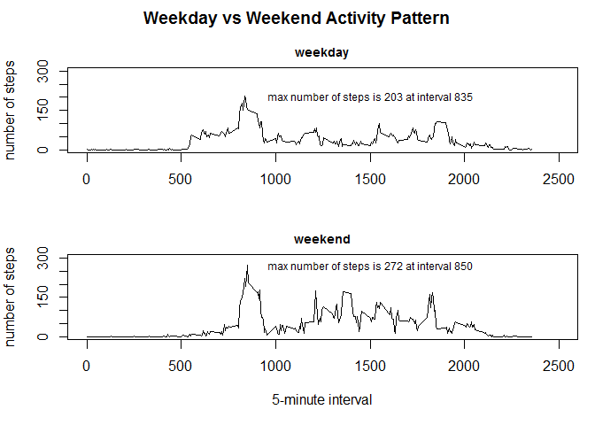

# Reproducible Research: Peer Assessment 1


## Loading and preprocessing the data
The GitHub repository contains the dataset for the assignment so it is not necessary to download the data separately.

The variables included in this dataset are:  
.	steps: Number of steps taking in a 5-minute interval (missing values are coded as NA)  
.	date: The date on which the measurement was taken in YYYY-MM-DD format  
.	interval: Identifier for the 5-minute interval in which measurement was taken  

The dataset is stored in a comma-separated-value (CSV) file and there are a total of 17,568 observations in this dataset.  
  
  


```r
library(dplyr);library(lubridate)
```

```
## 
## Attaching package: 'dplyr'
```

```
## The following objects are masked from 'package:stats':
## 
##     filter, lag
```

```
## The following objects are masked from 'package:base':
## 
##     intersect, setdiff, setequal, union
```

```
## 
## Attaching package: 'lubridate'
```

```
## The following object is masked from 'package:base':
## 
##     date
```

```r
unzip("activity.zip")

ds0 <- read.csv("./activity.csv",stringsAsFactors = FALSE)

# confirm size of the dataset (should be 17,568 rows and 3 variables)
dim(ds0)    
```

```
## [1] 17568     3
```

```r
# identify the column names
names(ds0)  
```

```
## [1] "steps"    "date"     "interval"
```

```r
# transform the date to a date object and group the dataset by date
ds0 <- mutate(ds0, date = as.Date(date) ) %>% 
         group_by(date)

dailySummary0 <- summarize(ds0,dailySteps = sum(steps, na.rm = TRUE))
```

  
  
  
## What is mean total number of steps taken per day?
First, we will look at the dataset without any modifications to missing values. Later, we will take a copy of the dataset and impute values for the missing data and report the differences.


```r
mean(dailySummary0$dailySteps)
```

```
## [1] 9354.23
```

```r
median(dailySummary0$dailySteps)
```

```
## [1] 10395
```
  
  
Now make a histogram of the total number of steps taken each day. Include the mean and median. 


```r
hist(dailySummary0$dailySteps, breaks = 10, 
     main = "Total Daily Steps (Before Imputing Missing Values)", xlab = "Steps")
abline(v=mean(dailySummary0$dailySteps), col= "blue", lty=2, lwd=2)
abline(v=median(dailySummary0$dailySteps), col= "green", lty=2, lwd=2)
legend("topright", legend = c("mean", "median"), col=c("blue","green"), lty=c(2,2), lwd=c(2,2))
```

<!-- -->


## What is the average daily activity pattern?
To answer this question, we will make a time series plot of the 5-minute interval (x-axis) and the average number of steps taken, averaged across all days (y-axis). 

First, we'll identify which 5-minute interval, on average across all the days in the dataset, contains the maximum number of steps  
  


```r
x0<- group_by(ds0, interval)
y0<-summarize(x0, Steps = mean(steps, na.rm = TRUE),0)

maxsteps<-paste("The maximum number of steps is",as.integer(y0[y0$Steps==max(y0$Steps),][2]),"at interval",as.integer(y0[y0$Steps==max(y0$Steps),][1]))

maxsteps
```

```
## [1] "The maximum number of steps is 206 at interval 835"
```
 

Now, display the time series plot and note the maximum number of steps 
  

```r
plot(unique(x0$interval),y0$Steps, type="l", main = "Number of Steps by 5-minute Interval", xlab = "5-minute interval", ylab="number of steps")
text(1600,200,maxsteps,cex = .75)
```

<!-- -->
 
  
  
  
## Imputing missing values
First, calculate and report the total number of missing values in the dataset.  

```r
sum(is.na(ds0))
```

```
## [1] 2304
```
  
  
Also, it might be nice to know which specific days are missing  

```r
unique(ds0$date[is.na(ds0$steps)])
```

```
## [1] "2012-10-01" "2012-10-08" "2012-11-01" "2012-11-04" "2012-11-09"
## [6] "2012-11-10" "2012-11-14" "2012-11-30"
```

  
  
  
###Devise a strategy for filling in all of the missing values in the dataset.
For each day that is missing data, use the average steps for that particular day over the two month period. For example, if data is missing on a Tuesday, use the average of all Tuesdays in the dataset.

First, create a new data file exactly the same as the first but with one additional variable called day to store the day of week. Then, calculate and store the mean number of steps for each interval of each day of the week in a temporary object. 
  

```r
ds1 <- mutate(ds0, day = wday(date))

tmp <- group_by(ds1, day, interval) %>% 
    summarize(dayMean = mean(steps, na.rm = TRUE),0)

head(tmp)
```

```
## Source: local data frame [6 x 4]
## Groups: day [1]
## 
##     day interval  dayMean   `0`
##   <dbl>    <int>    <dbl> <dbl>
## 1     1        0 0.000000     0
## 2     1        5 0.000000     0
## 3     1       10 0.000000     0
## 4     1       15 0.000000     0
## 5     1       20 0.000000     0
## 6     1       25 7.428571     0
```
  
  
  
Now assign the average to any missing day and confirm that the new dataset does not have any missing values (the sum of NA values should be zero).


```r
for ( i in 1:nrow(ds1) ) { 
    if (is.na(ds1$steps[i])) {
        ds1$steps[i] <- tmp$dayMean[tmp$day==ds1$day[i] & tmp$interval==ds1$interval[i]]
    }
}

sum(is.na(ds1))
```

```
## [1] 0
```
  
  
  
###Now, create a histogram of daily steps with the imputed missing values.
  

```r
dailySummary1 <- summarize(ds1,dailySteps = sum(steps, na.rm = TRUE))

hist(dailySummary1$dailySteps,breaks = 10, 
            main = "Total Daily Steps (After Imputing Missing Values)", xlab = "Steps")
abline(v=mean(dailySummary1$dailySteps), col= "blue", lty = 2, lwd=2)
abline(v=median(dailySummary1$dailySteps), col= "green", lty = 2, lwd=2)
legend("topright", legend = c("mean", "median"), col=c("blue","green"), lty=c(2,2), lwd = 2)
```

<!-- -->
  
  
  
  
###How do the mean and median differ now that values have been imputed for missing data?


```r
mean0 <- paste("mean BEFORE imputing values for missing data:", mean(dailySummary0$dailySteps))
mean1 <- paste("mean AFTER imputing values for missing data :", mean(dailySummary1$dailySteps))
median0 <- paste("median BEFORE imputing values for missing data:", median(dailySummary0$dailySteps))
median1 <- paste("median AFTER imputing values for missing data :", median(dailySummary1$dailySteps))
mean0
```

```
## [1] "mean BEFORE imputing values for missing data: 9354.22950819672"
```

```r
mean1
```

```
## [1] "mean AFTER imputing values for missing data : 10821.2096018735"
```

```r
median0
```

```
## [1] "median BEFORE imputing values for missing data: 10395"
```

```r
median1
```

```
## [1] "median AFTER imputing values for missing data : 11015"
```
  
  
We can also plot the number of steps before and after imputing values for the missing data so we can visualize the difference
  
  

```r
par(mfrow=c(2,1),mar=c(4,4,2,0), oma=c(1,0,2,0))

hist(dailySummary0$dailySteps, breaks = 10, 
     main = "", xlab="", ylim = c(0,20))
title(main = "Total Daily Steps By Interval", ylab = "frequency", outer = TRUE)

par(cex.main=.85)
title(main = "Before Imputing Missing Values", outer = FALSE)

abline(v=mean(dailySummary0$dailySteps), col= "blue", lty=2, lwd=2)
abline(v=median(dailySummary0$dailySteps), col= "green", lty=2, lwd=2)
legend("topright", legend = c("mean", "median"), col=c("blue","green"), lty=c(2,2), lwd=c(2,2))

hist(dailySummary1$dailySteps,breaks = 10, main = "After Imputing Missing Values", 
     xlab = "number of steps", ylim = c(0,20))
abline(v=mean(dailySummary1$dailySteps), col= "blue", lty = 2, lwd=2)
abline(v=median(dailySummary1$dailySteps), col= "green", lty = 2, lwd=2)
```

<!-- -->
  
  
  
  
## Are there differences in activity patterns between weekdays and weekends?
First, create a new factor variable in the dataset with two levels - "weekday" and "weekend" indicating whether a given date is a weekday or weekend day.


```r
ds1$dayType <- "weekday"
ds1$dayType[ds1$day==6 | ds1$day==7]<-"weekend"
ds1<-mutate(ds1, dayType = as.factor(dayType))
table(ds1$day,ds1$dayType)
```

```
##    
##     weekday weekend
##   1    2304       0
##   2    2592       0
##   3    2592       0
##   4    2592       0
##   5    2592       0
##   6       0    2592
##   7       0    2304
```
  
  
  
Now, make a panel plot containing a time series plot (i.e. `type = "l"`) of the 5-minute interval (x-axis) and the average number of steps taken, averaged across all weekday days or weekend days (y-axis).
  

```r
x1<- group_by(subset(ds1,dayType=="weekday"), interval)
y1<-summarize(x1, Steps = mean(steps, na.rm = TRUE),0)

par(mfrow=c(2,1),mar=c(4,4,2,1), oma=c(1,0,2,0))
plot(unique(x1$interval),y1$Steps, type="l",xlab = "", ylab = "number of steps",xlim = c(0,2500), ylim=c(0,300) )
title(main = "Weekday vs Weekend Activity Pattern", outer = TRUE)
par(cex.main=.85)
title(main = "weekday", outer = FALSE)
max1<-paste("max number of steps is",as.integer(y1[y1$Steps==max(y1$Steps),][2]),"at interval",as.integer(y1[y1$Steps==max(y1$Steps),][1]))
text(1500,200,max1,cex=.75)


x2<- group_by(subset(ds1,dayType=="weekend"), interval)
y2<-summarize(x2, Steps = mean(steps, na.rm = TRUE),0)

plot(unique(x2$interval),y2$Steps, type="l", main = "weekend",xlab = "5-minute interval", ylab = "number of steps",xlim=c(0,2500),ylim = c(0,300))
max2<-paste("max number of steps is",as.integer(y2[y2$Steps==max(y2$Steps),][2]),"at interval",as.integer(y2[y2$Steps==max(y2$Steps),][1]))
text(1500,270,max2,cex = .75)
```

<!-- -->
  


```
## [1] "end of report"
```
  


